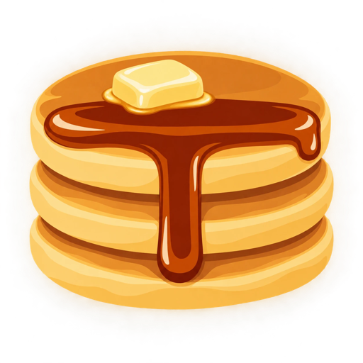
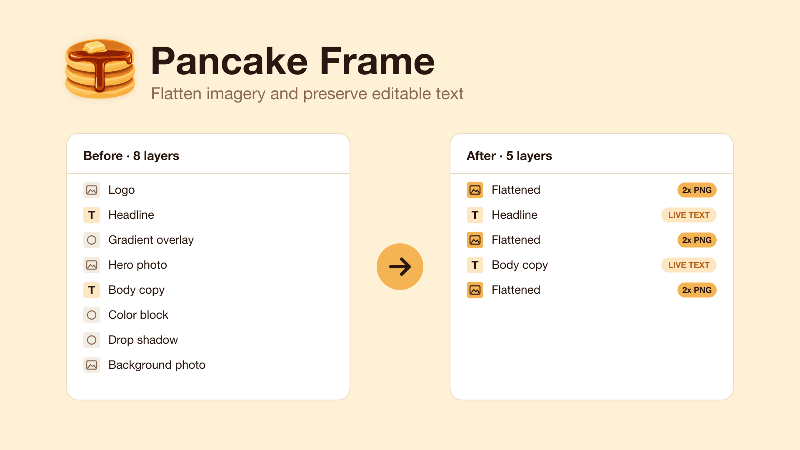

<p align="center">
  
</p>

<h1 align="center">Pancake Frame</h1>

<p align="center">
  <strong>Flatten imagery and preserve editable text.</strong><br>
  A Figma plugin that gets big proposals and decks ready for PDF export.
</p>

<p align="center">
  <a href="https://www.figma.com/community/plugin/1684622126932192921">Open in Figma</a>
  ·
  <a href="#how-it-works">How it works</a>
  ·
  <a href="#development">Development</a>
</p>



## Why

Heavy slides make heavy PDFs. Photos, gradients, shadows and nested mockups
all export as separate objects, which bloats files and sometimes breaks
shadows and transparency. Figma's built-in Flatten doesn't help, because it
turns your text into outlines too.

Pancake Frame bakes everything *except* the text. You get a much smaller PDF,
and the words stay crisp, selectable and editable.

## Usage

1. Select one or more frames.
2. Run **Pancake Frame** from the Plugins menu. Upstatement folks will find it
   under plugins from Upstatement.
3. Each frame is flattened in place, and a notification tells you how many
   images were created.

One Cmd+Z undoes the whole run. Duplicate the frame first if you want to
keep the original.

## How it works

Pancake Frame looks at the layers directly inside each selected frame, from
the bottom of the stack up. Every stretch of consecutive non-text layers is a
**run**. Text layers break runs and are never touched.

Each run is grouped, exported as a 2x PNG, and replaced by a single rectangle
named `Flattened` in exactly the same stacking position. Because Figma
renders the whole run at once, overlaps, blend modes, opacity and shadows come
out identical to the original.

```
Before                 After
──────                 ─────
Logo                   Flattened    ← run 1
T  Headline            T  Headline
Gradient overlay       Flattened    ← run 2
Hero photo
T  Body copy           T  Body copy
Color block            Flattened    ← run 3
Drop shadow
Background photo
```

## Good to know

- **Only top-level text stays live.** Text nested inside groups, frames or
  components is baked into the image. Move text you want to keep editable to
  the top level of the frame.
- **Very large layers export below 2x** so they stay within Figma's 4096px
  image limit.
- **Hidden layers are dropped** when nothing in their run is visible, since
  they wouldn't show up anyway.
- **Masks** inside a run stop masking text above them once flattened.
- **No network access.** Nothing leaves your file.

## Development

Needs Node 22.18 or newer, which runs the TypeScript tests without a build step.

```bash
npm install
npm run build
```

In the Figma desktop app, choose **Plugins > Development > Import plugin from
manifest** and pick `manifest.json`. Run `npm run watch` to rebuild on save.

| Script | What it does |
| --- | --- |
| `npm test` | Unit tests for the run-partitioning logic |
| `npm run typecheck` | Type-checks the plugin and the tests |
| `npm run build` | Bundles `src/` into `code.js`, which Figma loads |
| `npm run watch` | Rebuilds `code.js` on every change |
| `npm run assets` | Renders `assets/icon.png` and `assets/thumbnail.png` from their SVGs. Needs `rsvg-convert` (`brew install librsvg`) |

The code lives in two files:

- [`src/partition.ts`](src/partition.ts) decides which layers become images.
  It's a pure function with unit tests in [`test/`](test).
- [`src/code.ts`](src/code.ts) does the Figma work: grouping, exporting and
  swapping in the image rectangles.

To publish a new version, build, then open **Plugins > Manage plugins** in
Figma and choose **Publish new version** from the plugin's menu.

The original design and plan are in [`docs/`](docs).
